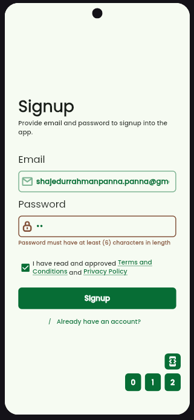
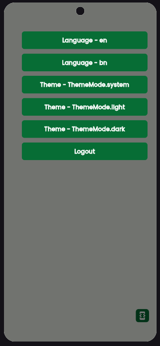
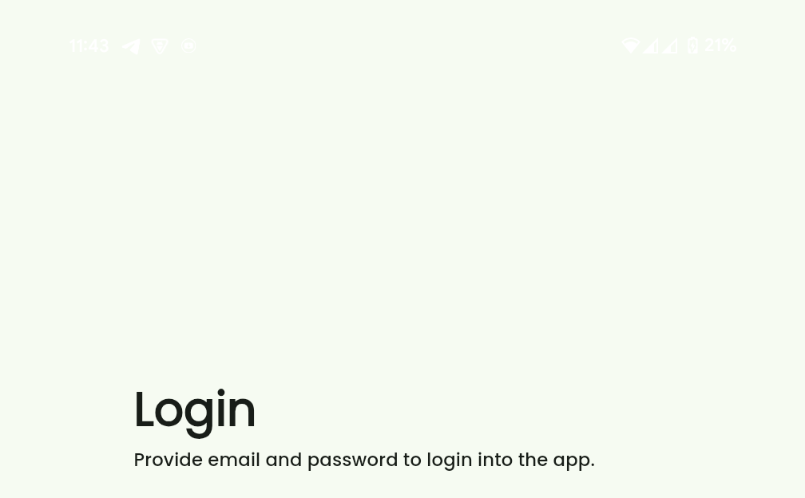
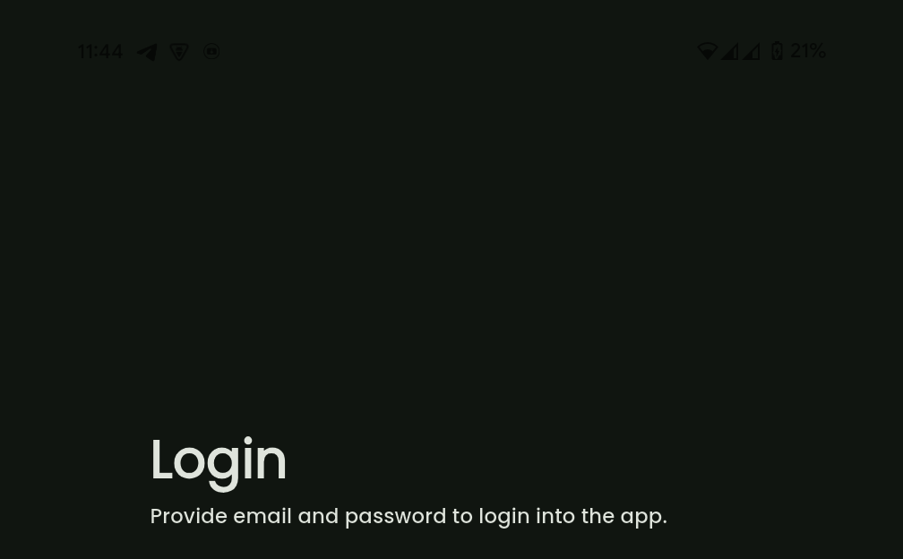
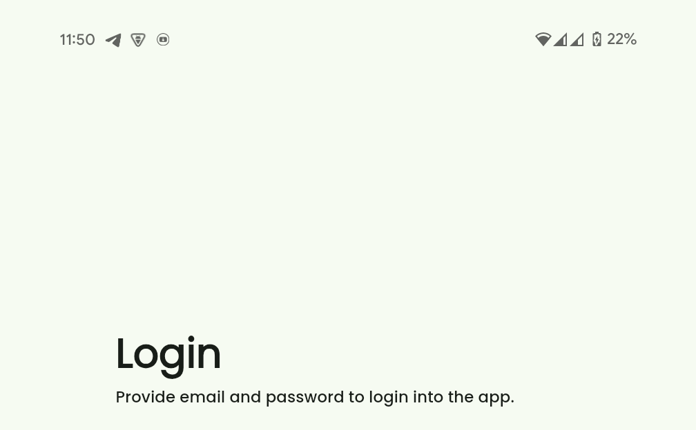
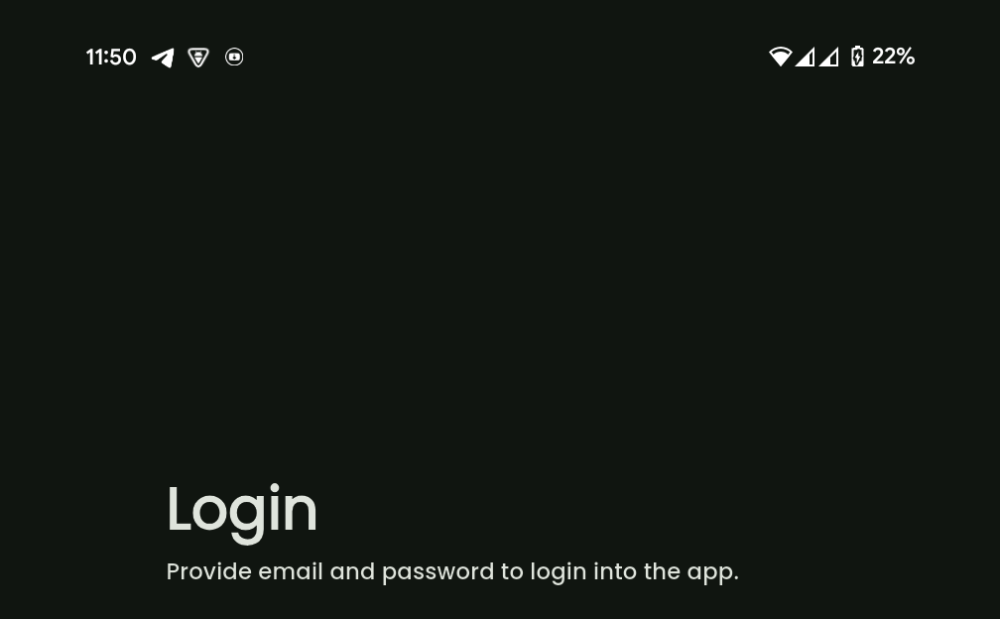

# Flutter GetX MVC Template

A scalable, production-ready Flutter project template following **MVC architecture** powered by **GetX**.
This template also blends Clean Architecture concepts such as use cases and repositories — perfect for complex app development.

**Note: For developers using this template, the [Material 3 Demo](https://flutter.github.io/samples/web/material_3_demo/) provides a preview of Material 3 widgets, helping you design consistent and modern UI elements for your app.**

## Features

- MVC architecture (Model, View, Controller)
- Clean Architecture principles (UseCases, Repositories)
- GetX for routing, state, and dependency injection
- Easy localization setup
- Modular theming
- Dev tools for testing and debugging
- Scalable folder structure for real-world apps

## Folder Structure

```
📦lib
 ┣ 📂assets
 ┣ 📂src
 ┃ ┣ 📂controllers
 ┃ ┃ ┣ 📂data_controllers
 ┃ ┃ ┃ ┣ 📜app_data_controller.dart
 ┃ ┃ ┃ ┗ 📜auth_controller.dart
 ┃ ┃ ┗ 📂screen_controllers
 ┃ ┃ ┃ ┣ 📂authentication
 ┃ ┃ ┃ ┃ ┣ 📜controller.dart
 ┃ ┃ ┃ ┃ ┣ 📜repository.dart
 ┃ ┃ ┃ ┃ ┗ 📜use_case.dart
 ┃ ┃ ┃ ┗ 📂splash_screen
 ┃ ┃ ┃   ┗ 📜controller.dart
 ┃ ┣ 📂core
 ┃ ┃ ┣ 📂environment
 ┃ ┃ ┃ ┗ 📜environment.dart
 ┃ ┃ ┣ 📂http
 ┃ ┃ ┃ ┣ 📜http_client.dart
 ┃ ┃ ┃ ┣ 📜http_error_enum.dart
 ┃ ┃ ┃ ┣ 📜http_error_handler.dart
 ┃ ┃ ┃ ┗ 📜http_repository.dart
 ┃ ┃ ┣ 📂localization
 ┃ ┃ ┃ ┣ 📜app_translations.dart
 ┃ ┃ ┃ ┗ 📜string_enum.dart
 ┃ ┃ ┣ 📂theme
 ┃ ┃ ┃ ┣ 📜app_theme.dart
 ┃ ┃ ┃ ┣ 📜colors.dart
 ┃ ┃ ┃ ┗ 📜text_styles.dart
 ┃ ┃ ┗ 📂use_case
 ┃ ┃   ┗ 📜use_case.dart
 ┃ ┣ 📂models
 ┃ ┃ ┗ 📂data
 ┃ ┃ ┃ ┣ 📂api_models
 ┃ ┃ ┃ ┗ 📂app_models
 ┃ ┃ ┃   ┗ 📜user_model.dart
 ┃ ┣ 📂utils
 ┃ ┃ ┣ 📂dev_functions
 ┃ ┃ ┃ ┣ 📜dev_auto_fill_button.dart
 ┃ ┃ ┃ ┣ 📜dev_button.dart
 ┃ ┃ ┃ ┣ 📜dev_print.dart
 ┃ ┃ ┃ ┗ 📜dev_scaffold.dart
 ┃ ┃ ┣ 📂functions
 ┃ ┃ ┃ ┣ 📜form_validation.dart
 ┃ ┃ ┃ ┗ 📜string_conversion.dart
 ┃ ┃ ┗ 📂user_message
 ┃ ┃   ┗ 📜snackbar.dart
 ┃ ┗ 📂views
 ┃   ┣ 📂screens
 ┃   ┗ 📂widgets
 ┣ 📜components.dart
 ┗ 📜main.dart
```

This is a detailed folder structure. In short, we may focus on the simplified structure shown below:

```
📦lib
 ┣ 📂assets
 ┣ 📂src
 ┃ ┣ 📂controllers
 ┃ ┃ ┣ 📂data_controllers // ----------------------------- App Data Will be here
 ┃ ┃ ┃ ┣ 📜app_data_controller.dart
 ┃ ┃ ┃ ┗ 📜auth_controller.dart
 ┃ ┃ ┗ 📂screen_controllers // ------------- Screen functionalities will be here
 ┃ ┣ 📂core
 ┃ ┃ ┣ 📂environment // --------------------------------------- Handle .ENV file
 ┃ ┃ ┣ 📂http // ----------------------------------------------- Handle API call
 ┃ ┃ ┣ 📂localization // ----------------------------------- Handle App Language
 ┃ ┃ ┣ 📂theme // --------------------------------------------- Handle App theme
 ┃ ┃ ┗ 📂use_case // -- Abstract class, Handles USE CASE from Clean Architecture
 ┃ ┣ 📂models
 ┃ ┃ ┗ 📂data // ----------------------------- App Models and Enums will be here
 ┃ ┃   ┣ 📂api_models
 ┃ ┃   ┗ 📂app_models
 ┃ ┣ 📂utils // ------------------------ App Utils (Form validation, Print, ...)
 ┃ ┗ 📂views // --------------------------------------------------------- App UI
 ┃   ┣ 📂screens
 ┃   ┗ 📂widgets
 ┣ 📜components.dart // -------------------------- App Components (Default Size)
 ┗ 📜main.dart
```

## MVC Responsibilities

| Layer          | Description                                        |
| -------------- | -------------------------------------------------- |
| **Model**      | App & API models, used across the app              |
| **View**       | Screens and widgets rendered on the UI             |
| **Controller** | Logic layer using GetX, handles state & UI actions |

## Clean Architecture Additions

- `use_case/`: Abstract actions representing app-specific business logic
- `repository.dart`: Optional repository interface per feature for scalability
- `http_repository.dart`: Base HTTP handler using dependency inversion

## Getting Started

1. Download the Template from Github.
2. In `New Project` copy those files and folders below and paste in exactly same location in New project:
   1. lib
   2. .env
   3. analysis_options.yaml
3. Add these dependencies in `pubspec.yaml`. Keeping dependencies updated ensures better security, performance, and access to new features. To check for the latest versions, run `pub outdated` in the terminal.

```yml
on_process_button_widget: ^2.0.6
on_text_input_widget: ^0.0.7
flutter_dotenv: ^5.2.1
get: ^4.7.2
flutter_screenutil: ^5.9.3
google_fonts: ^6.2.1
get_storage: ^2.1.1
tuple: ^2.0.2
device_preview: ^1.2.0
flutter_svg: ^2.0.17
fluttertoast: ^8.2.12
url_launcher: ^6.3.1
dio: ^5.8.0+1
package_info_plus: ^8.3.0
```

4. Add the following asset files and folders to the `pubspec.yaml` file under the `flutter` section to ensure they are properly included in your project:

```yml
flutter:
  ...

  assets:
    - .env

    - lib/assets/svg/logos/
    - lib/assets/svg/icons/
    ...
```

5. Run `dart pub get`.

## Development Functions

There are some necessary utils for development purpose in `lib/src/utils/dev_functions` folder. That helps to make development more easier.

### devPrint()

`devPrint` use to print something in development mode.

- `heading`: Heading for the log block.
- `color`: Color for the message text.
  For more read API documentation.

```dart
devPrint(
    'Print Something',
    heading: 'HttpErrorHandler',
    color: DevPrintColorEnum.red,
);
```

### DevAutoFillButton

`DevAutoFillButton` is a button set that only shows in development mode, allowing developers to quickly autofill forms with predefined data during testing. For example, you can use it to populate login fields with test credentials, saving time and effort during repetitive tasks.

Check `lib/src/views/screens/authentication/authentication_wrapper_screen.dart` for example.



### DevScaffold

`DevScaffold` is a custom scaffold widget that only shows in development mode. It provides extra functions such as changing Language, Theme Mode.

Wrap the `Scaffold` with the `DevScaffold` widget to utilize these features. For example, you can use it to log API responses directly on the screen for quick debugging.

Check API Documentation for more details and `lib/src/views/screens/authentication/authentication_wrapper_screen.dart` for example.



## Theme and Color

This template supports theming, allowing you to easily customize colors and styles. To change the theme, edit the files in the `lib/src/core/theme` folder. For example, you can modify the app's primary color by updating the `primaryColor` in `lib/src/core/theme/colors.dart`. After making changes, test the theme by running the app and navigating to screens that use the updated styles to ensure consistency and correctness.

### Material Theme Builder

The Material Theme Builder is a tool that helps developers create custom color themes tailored to their app's design requirements.

To use it:

1. Go to [Material Theme Builder](https://material-foundation.github.io/material-theme-builder/)
2. Provide color code [Note: Make sure you turn on the `Color Match` option] and go to Text selection section
3. Pick a suitable text for app
4. Export the theme as a Dart file and save the compressed file in local device. Unzip the file.
5. Copy the `light ColorScheme` from the `lightScheme()` function and `dark ColorScheme` from the `darkScheme()` function, which can be found in the exported Dart file (usually named `theme.dart` or similar). Paste them into the `lib/src/core/theme/colors.dart` file in your project.
6. To use color:

```dart
Theme.of(context).colorScheme.primary // For primary color
```

7. To edit Text go to `lib/src/core/theme/text_styles.dart` file and change the font name.

### AppTheme

- `setSafeAreaColor(BuildContext context)`: This makes the top notification bar transparent, ensuring a seamless visual experience by blending the app's UI with the system's status bar. It is particularly useful in apps with immersive designs or custom themes where maintaining a consistent color scheme across the entire screen enhances the user experience.

  <div align="center" style="display: flex; justify-content: center; flex-wrap: wrap; gap: 12px;">
    <div style="flex: 1; min-width: 250px; max-width: 400px; text-align: center;">
      
      <p><strong>Light Theme</strong></p>
    </div>

    <div style="flex: 1; min-width: 250px; max-width: 400px; text-align: center;">
      
      <p><strong>Dark Theme</strong></p>
    </div>
  </div>

  Without `setSafeAreaColor` the top navigation icon is not visible.

  <div align="center" style="display: flex; justify-content: center; flex-wrap: wrap; gap: 12px;">
    <div style="flex: 1; min-width: 250px; max-width: 400px; text-align: center;">
      
      <p><strong>Light Theme</strong></p>
    </div>

    <div style="flex: 1; min-width: 250px; max-width: 400px; text-align: center;">
      
      <p><strong>Dark Theme</strong></p>
    </div>
  </div>

  Using `setSafeAreaColor` the top navigation icon is visible.

- Always initialize the theme in the main function to ensure the app's UI adheres to the desired theme settings from the start. Failing to do so may result in inconsistent or default styling being applied before the theme is properly set.

```dart
void main() async {
  WidgetsFlutterBinding.ensureInitialized(); // Ensure Flutter bindings are initialized
  ThemeMode themeMode = await AppTheme.init; // Initialize theme
  runApp(MyApp(themeMode: themeMode)); // Pass the theme mode to the app
}
```

## Localization: Adding and Managing Multiple Languages

This template supports Localization.
To add language follow those steps below:

1. Go to this file `lib/src/core/localization/app_translations.dart`.
2. Add language in `supportedLocales` variable

```dart
static const List<Locale> supportedLocales = <Locale>[
  Locale('en'),
  ...
];
```

3. Also add language in `keys`.

```dart
Map<String, Map<String, String>> get keys {
  return <String, Map<String, String>>{
    'en': _generateTranslations((TextEnum e) => e._en),
    ...
  };
}
```

4. Go to this file `lib/src/core/localization/string_enum.dart`.
5. Add the `TextEnum` for the desired language by defining the text keys and their corresponding translations. For example, to add a new text key for English, update the `TextEnum` as follows:

```dart
enum TextEnum {
  iHaveReadAndApproved(
    en: 'I have read and approved',
    bn: 'আমি পড়েছি এবং অনুমোদিত করেছি',
  ),

  const TextEnum({required String en, String? bn})
  : _en = en,
    _bn = bn ?? en;

  // TODO: Add language
  final String _en;
  final String _bn;
}
```

6. To use the Text according to App Language, use `TextEnum.iHaveReadAndApproved.tr`.
   The `.tr` is a GetX extension method that retrieves the localized string for the current app language,
   making it easy to display text in the user's preferred language.
7. Initialize the local in main

```dart
void main() async {
  WidgetsFlutterBinding.ensureInitialized(); // Ensure Flutter bindings are initialized
  Locale locale = await AppTranslations.init; // Initialize translations
  runApp(MyApp(locale: locale)); // Pass the locale to the app
}
```

8. Add local and translations inside the GetMaterialApp.

`fallbackLocale` specifies the default locale to use if the user's locale is not supported. This ensures the app always has a valid language setting.

```dart
GetMaterialApp(
  locale: locale,
  fallbackLocale: AppTranslations.supportedLocales.first,
  translations: AppTranslations(),
  ...
)
```

## Environment(.env)

`.env` file contains secret information like keys, passwords, API host link. To use .env file follow those steps bellow:

1. Create a `.env` file in root directory in the project.
2. Inside the env file write information according to the project needs.

```env
API_BASE_URL="https://dummyjson.com/"
API_VERSION="v1/"
```

3. Add .env file in `pubspec.yaml` file assets.

```yml
flutter:
  ...
  assets:
    - .env
    ...
```

4. Go to `lib/src/core/environment/environment.dart` file and edit the class according to env variables. Must use Static keyword to access those values from anywhere of the app.
5. Initialize the Environment in main.

```dart
void main() async {
  WidgetsFlutterBinding.ensureInitialized(); // Ensure Flutter bindings are initialized
  await Environment.init; // Initialize environment
  runApp(MyApp());
}
```

## Creating New Screen and Connecting Controller and Use Case

It is very important to manage class and variable cleverly Because if a class or variable is defined publicly it can be made harder to find the actual class or variable. This can make the development environment harder for the developer. So always make the class and variables private for any particular screen. To access the private class or variable from that screen use `part` and `part of`.

### Screen

All screen will be stateful screen as they will initiate the Controller. And all classes and variables those are connected to this screen will be imported in this screen with `part`. For example follow the `lib\src\views\screens\authentication\authentication_wrapper_screen.dart`.

```dart
part '../../../controllers/screen_controllers/authentication/controller.dart'; //  Screen Controller
part '../../../controllers/screen_controllers/authentication/repository.dart'; // ------- Repository
part '../../../controllers/screen_controllers/authentication/use_case.dart'; // ----------- Use Case

/// AuthenticationWrapperScreen
class AuthenticationWrapperScreen extends StatefulWidget {
  /// AuthenticationWrapperScreen Constructor
  const AuthenticationWrapperScreen({super.key});

  @override
  State<AuthenticationWrapperScreen> createState() =>
      _AuthenticationWrapperScreenState();
}
```

### Screen Controller

Screen controller will handle all the Screen (UI) functionalities and connect API or other controllers. To create a Screen controller we need to extend GetxController, and pair it with the screen using `part of`

```dart
part of '../../../views/screens/authentication/authentication_wrapper_screen.dart';

/// Handles authentication screens
class _AuthenticationScreenController extends GetxController {
  /// Get [_AuthenticationScreenController] GetxController
  static _AuthenticationScreenController get find => Get.find();

  // ...
}
```

### Data Handling (Use case, Repository)

#### Use case

To Connect API or database a UseCase needs to be added in the Screen Controller that is extended from `BaseUseCase`. This UseCase class handles all data-related tasks (Fetching data from/to API or database).
Here `saveData` and `readData` functions can be found.

Also, import this UseCase in the Screen using `part` in the Screen file and `part of` in the UseCase file.

```dart
part of '../../../views/screens/authentication/authentication_wrapper_screen.dart';

/// Handles authentication screens repository
class _AuthenticationScreenUseCase extends BaseUseCase {
  final _AuthenticationScreenRepository _repository =
      _AuthenticationScreenRepository();

  // ...
}
```

For more, see the example `lib/src/controllers/screen_controllers/authentication/use_case.dart`.

#### Repository

To fetch data from/to API a Repository is needed to be added in the UseCase that is extended from
`HttpRepository`. Where `httpClient` and `errorHandler` will be found.

1. `httpClient` will be used to get API functionalities.
2. `errorHandler` will be used to handle errors. All API calling functions will be passed through the `errorHandler`.

Also, import this Repository in the Screen using `part` in the Screen file and `part of` in the Repository file.

```dart
part of '../../../views/screens/authentication/authentication_wrapper_screen.dart';

class _AuthenticationScreenRepository extends HttpRepository {
  /// [login]
  Future<UserModel?> login() async {
    UserModel? result;

    // TODO: Simulate a network request
    await errorHandler.errorHandler( // --------------------------- errorHandler
      function: () async {
        final String url = 'auth/login';
        final dio.Response<Map<String, dynamic>> response =
            await httpClient.post( // ------------------------------ Calling API
          url,
          body: <String, dynamic>{
            'username': 'emilys',
            'password': 'emilyspass',
            'expiresInMins': 30,
          },
        );

        if (response.statusCode != 200 || response.data == null) {
          throw response; // ------------ Throw the response if any error occurs
        }

        result = UserModel.fromMap(response.data!);
      },
    );

    return result;
  }
}
```

For more, see the example `lib/src/controllers/screen_controllers/authentication/repository.dart`.

## Good Coding (analysis_options.yaml)

Better code means better development experience. So `flutter_lints` can be used and rules are added in the `analysis_options.yaml` file.

See the example in `analysis_options.yaml`

1. API Documentation must be added to the Public classes and variables.
2. Must add type annotation.
3. Must use const if needed.
4. Always check Spelling errors.
5. Keep lines in 80 characters.
6. Use meaningful names for the variables.
